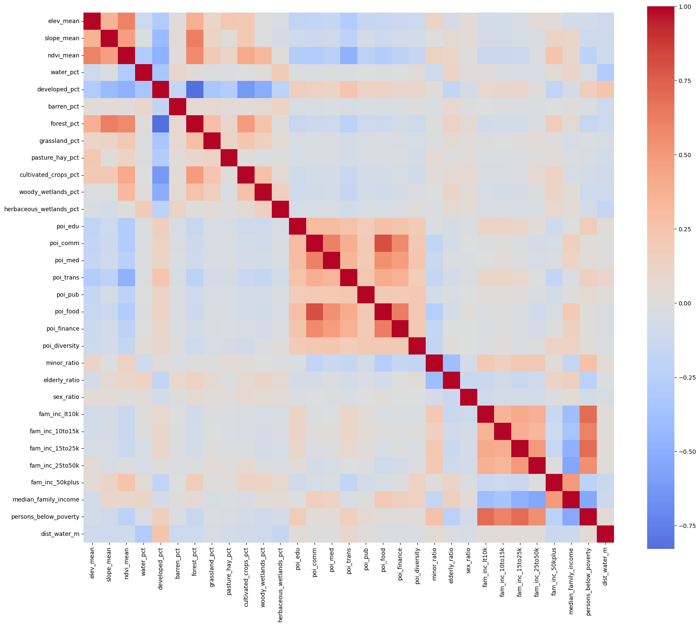
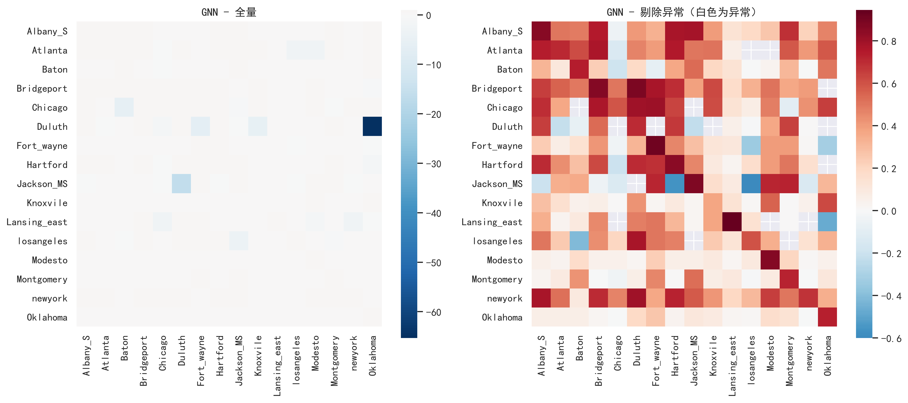
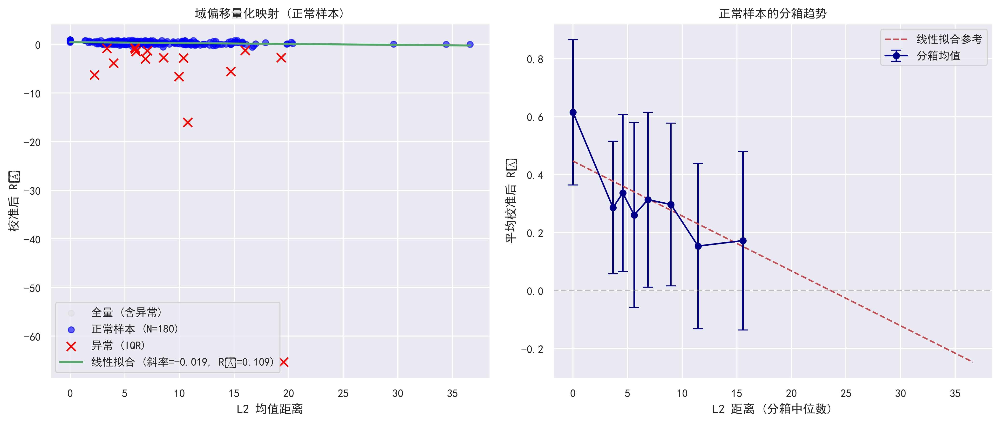

# 面向人口预测任务的地理空间基础模型空间可迁移能力评估

**Evaluating the Spatial Transferability of a Geospatial Foundation Model (AEF) for Population Prediction**

> 以美国大都市统计区(MSA)的人口估计为下游任务,评估 Google DeepMind **AlphaEarth Foundations (AEF)** 卫星嵌入的空间可迁移能力,并与传统 GIS 特征对比,归因人口预测误差的空间不均匀性。

- 指导老师:周智勇
- 组长:李书亦　组员:刘桂心瑜、于佳灵

---

## 1. 研究背景与科学问题

当前地理空间基础模型(GeoFM)研究重「外部评估」、缺「内部评估」;AEF 对人口估计的提升在**空间与尺度上并不均匀**。本研究以人口估计为下游任务,系统评估 AEF 的空间可迁移能力。

**三个研究问题:**
1. AEF 是否具有进行人口预测的能力?
2. AEF 与传统 GIS 数据在不同城市之间的可迁移性如何?
3. 模型迁移能力与数据特征距离是否存在相关性?

**三个任务:**

| 任务 | 内容 | 方法 | 产出 |
|------|------|------|------|
| **任务一 · 特征工程对照** | 三组特征对比:① 仅 AEF　② 仅 GIS　③ AEF+GIS 融合 | 解码器 GNN(GraphSAGE)/ MLP,备选 Ridge / RF | R² / RMSE / MAE / KL;空间误差地图、残差 LISA |
| **任务二 · 可迁移性** | 15×15 全连接迁移矩阵,每对 (source→target) 评估迁移性 | 域偏移量化(AEF 嵌入距离 L1/L2/余弦/MMD + GIS 特征距离);回归「特征距离 → 迁移性能」 | N×N 迁移矩阵;验证「距离越大,迁移越差」 |
| **任务三 · 归因 + 验证** | 迁移性能(因变量)~ AEF 本征属性(Moran's I / Shannon 熵 / 余弦 / KL) | 多变量回归(R²>0.7 支持"本征可迁移性假设");变换 CV 策略、Moran's I / LISA;按高/中/低特征距离选 MSA 外部验证 | 归因模型;系统偏差 vs 验证误差的分离 |

> 建模实现见 [`model/`](model/):解码器每城自训练后做跨城迁移,再由 `Analysis/` 归因。城内采用随机 70/15/15 划分,跨城泛化由迁移脚本单独评估(整个目标城当测试集)。

---

## 2. 研究区与研究单元

- **研究单元:** Census Tract(普查区,约 1,200–8,000 人,理想约 4,000 人)
- **人口标签:** 美国官方统计数据(Census Bureau / ACS 表 `B01003`,`Estimate!!Total`);因 WorldPop(~1km)分辨率不足以支撑 tract 级预测,改用官方统计口径
- **抽样:** 从筛选出 tract 数 > 100 的 MSA 中,按人口分**高 / 中 / 低**三层随机抽样,得到 **15 个 MSA**

| 层级 | MSA(CBSA) | 2020 人口 | tract 数 |
|------|-----------|-----------|---------|
| high | New York-Newark-Jersey City, NY-NJ-PA (35620) | 19,261,570 | 4,953 |
| high | Chicago-Naperville-Elgin, IL-IN-WI (16980) | 9,478,801 | 2,335 |
| high | Atlanta-Sandy Springs-Alpharetta, GA (12060) | 5,947,008 | 1,500 |
| high | Oklahoma City, OK (36420) | 1,397,040 | 419 |
| high | Hartford-East Hartford-Middletown, CT (25540) | 1,205,842 | 308 |
| medium | Bridgeport-Stamford-Norwalk, CT (14860) | 944,306 | 227 |
| medium | Albany-Schenectady-Troy, NY (10580) | 880,766 | 251 |
| medium | Knoxville, TN (28940) | 861,872 | 225 |
| medium | Baton Rouge, LA (12940) | 856,779 | 215 |
| medium | Jackson, MS (27140) | 596,287 | 160 |
| low | Lansing-East Lansing, MI (29620) | 547,786 | 154 |
| low | Modesto, CA (33700) | 546,235 | 112 |
| low | Fort Wayne, IN (23060) | 409,419 | 104 |
| low | Montgomery, AL (33860) | 373,552 | 112 |
| low | Duluth, MN-WI (20260) | 289,276 | 104 |

---

## 3. 数据

### 3.1 AEF 嵌入(核心数据)

**AlphaEarth Foundations Satellite Embedding**(Google & Google DeepMind),经 Google Earth Engine 获取。提取 2020 年 AEF 影像,与各 MSA 的普查区边界叠加,对每个普查区内所有 10m 像素取平均,得到每区域 **64 维**特征向量,导出 CSV。

- 规格:64 维 · 10m · 年度(2017–2024,本研究用 2020)
- 预处理:尺度对齐到普查单元;AEF 暂不标准化;人口长尾则 log 变换;稀疏区 mask

### 3.2 传统 GIS 特征目录

所有特征均聚合到 census tract 级,连接键统一为 `cb_2020_3`(`1400000US` + 11 位 tract 码),原始值输出、标准化交统一建模流程。

**第一块 · 社会经济**

| 特征组 | 文件 | 主要字段 | 来源 / 尺度 / 时间 |
|--------|------|----------|-------------------|
| 人口结构 | `pop_features_15msa.csv` | `minor_ratio`(未成年占比)、`elderly_ratio`(老年占比)、`sex_ratio`(男/女×100) | ACS 5-year 2016–2020,表 DP05 |
| 收入 / 贫困 | `socioeconomic_features_15msa.csv` | 家庭收入 5 档户数、`median_family_income`、`per_capita_income`、`persons_below_poverty`(+ `*_moe`) | IPUMS NHGIS(底层 ACS 5yr 2016–2020,表 A88/AB2/BD5/CL6) |

**第二块 · 人类活动与建成环境**

| 特征组 | 文件 | 主要字段 | 来源 / 分辨率 / 时间 |
|--------|------|----------|---------------------|
| 土地覆盖 | `nlcd_features_15msa.csv` | 10 类 `*_pct` 面积占比 + `impervious_mean`(不透水面) | Annual NLCD 2020(MRLC),30m |
| 夜间灯光 | `ntl_features_15msa.csv` | `ntl_sum/mean/intensity_per_km2/std/cv/max/min/count` | VIIRS Nighttime Lights Annual V2 (masked) 2020,~500m |
| 建筑 | `building_features_15msa.csv` | `building_count`、`building_area_m2`、`building_density`、`coverage_ratio` | OpenStreetMap 建筑轮廓,经 ohsome API,2020 |
| POI | `poi_features_15msa.csv` | `poi_edu/comm/med/trans/pub/food/finance`、`poi_total_all`、`poi_diversity` | OpenStreetMap,2020 |
| 道路 | `road_features_15msa.csv` | `road_len_total_m`、`road_density_local/secondary` | Census TIGER,2020 |
| 景观格局 | `landscape_indices_tract_*.csv`(per-MSA,待合并) | 景观格局指数 | 基于土地覆盖栅格 |

**第三块 · 地理与环境**

| 特征组 | 文件 | 主要字段 | 来源 / 分辨率 / 时间 |
|--------|------|----------|---------------------|
| 地形 | `dem_features_15msa.csv` | `elev_mean`(高程)、`slope_mean`(坡度) | USGS 3DEP(经 GEE,~10m 取样至 30m) |
| 植被 | `ndvi_features_15msa.csv` | `ndvi_mean` | Landsat C2 T1 L2 年度 NDVI 合成(GEE),30m,2020 |
| 树冠 | `tcc_features_15msa.csv` | `tcc_mean`(树冠覆盖率) | USFS/NLCD Tree Canopy Cover(GEE),30m,2020 |
| 水体距离 | `water_dist_features_15msa.csv` | `dist_water_m`(到最近水体平均距离) | JRC Global Surface Water v1.4(GEE),30m,2020 |

> 每个特征目录下都有一份 `README.md`(由对应 `*_数据说明.docx` 整理生成),含完整字段口径、处理方法与来源引用。

各特征(含社会经济/建成环境/地理环境)之间的相关性:



---

## 4. 仓库结构

```
AEF-Population-Prediction/
├── README.md
├── .gitignore
├── data_AEF/                     # 纯 AEF 输入:每 MSA 的 64 维嵌入(aef_*_b*_2020.csv)+ 边界
├── data_GIS/                     # 纯 GIS 输入:每 MSA 的 GIS 特征(gis_*_b0_2020.csv)+ 边界
│   ├── create_dataset.ipynb      #   GIS 数据集构建流程
│   └── feature_corr.ipynb        #   特征相关性分析
├── MSA/                          # 研究区(见 MSA/README.md)
│   └── 15MSA/                    #   高/中/低分层抽样脚本 + 15MSA 名单 / tract 清单 / 人口标签
├── 传统GIS特征数据/               # 各特征的提取代码 + 每个数据集文件夹的 README
│   ├── 15msa/                    #   处理后 15MSA 特征表(dem/ndvi/nlcd/poi/pop/socioeconomic/tcc/water/building/ntl/road)
│   ├── 社会经济数据/              #   NHGIS / 人口结构
│   ├── 人类活动和建成环境/         #   建筑 / POI / 土地覆盖 / 夜间灯光 / 道路 / 景观格局
│   └── 地理数据和环境数据/         #   DEM / NDVI / 树冠 / 水体距离(GEE .js 脚本)
└── model/                        # 建模、迁移与归因(见 model/README.md)
    ├── GNN/                      #   GraphSAGE 自训练 + 跨城迁移
    ├── MLP/                      #   MLP 自训练 + 迁移诊断(Ridge/null/校准/域距离)+ 输入数据
    ├── Analysis/                 #   迁移矩阵分析、可视化、域偏移归因回归
    └── AEF_plus_GIS/             #   AEF + 单个 GIS 特征的迁移实验结果
```

> **未入库内容**(见 `.gitignore`):census 原始下载、全国 tract 级中间 CSV、`nhgis0001*`(NHGIS 原始表禁止再分发)、汇报 PPT/PDF/Word、`.crdownload` 半成品。
> **暂时移出**:合并数据集目录 `GIS-feature-dataset/`(整理后再放回;旧内容保留在 git 历史中)。

---

## 5. 数据可用性与合规

- ⚠️ **NHGIS 原始数据禁止再分发**:本仓库仅提供处理代码与来源说明,不包含 NHGIS 原始表(`nhgis0001*`)。请自行从 [data2.nhgis.org](https://data2.nhgis.org) 获取。
- MSA 边界矢量:[TIGER/Line 2020 CBSA](https://www2.census.gov/geo/tiger/TIGER2020/CBSA/)
- 人口标签:[Census Bureau Data](https://data.census.gov/)(表 B01003 / DP05)
- 遥感与环境特征均可经 [Google Earth Engine](https://earthengine.google.com/) 复现(见各 `*_gee.js` 脚本)

**数据来源引用:**
- IPUMS NHGIS, University of Minnesota, [www.nhgis.org](https://www.nhgis.org)
- VIIRS Nighttime Lights Annual V2 (masked), Earth Observation Group, Colorado School of Mines
- Pekel et al., 2016, *Nature*(JRC Global Surface Water)
- USGS 3DEP;Annual NLCD (MRLC);USFS/NLCD Tree Canopy Cover;Landsat / OpenStreetMap

---

## 6. 研究进展(截至 2026-07-16)

- ✅ 完成全部特征数据准备(社会经济 / 人类活动与建成环境 / 地理与环境三大块)
- ✅ 跑通 GNN(GraphSAGE)与 MLP 两套解码器的自预测:多数城市 self-prediction 收敛并取得正 R²,**AEF 具备人口预测能力**
- ✅ 获得 GNN / MLP 的 15×15 跨城迁移矩阵,并完成域偏移归因

GNN 跨城迁移矩阵(校准后,行=源城、列=目标城;左=全量,右=剔除 IQR 异常后,白色为异常对):



**归因分析主要结论**(详见 `model/Analysis/README.md`,源自《实验方案记录》1.1–1.6):

| # | 分析 | 结论 |
|---|------|------|
| 1.1 | 解码器退化(Ridge vs GNN) | Ridge 迁移更差 → 图结构信息对迁移有正向作用,复杂解码器非负迁移主因 |
| 1.2 | 零模型(打乱特征) | 仍出现大负值 → 模型存在**源域均值锚定的输出偏置** |
| 1.3–1.4 | 均值校准 + IQR 异常剔除 | 校准并剔除 16 对(8.2%)异常后,真实 GNN 迁移均值由 −0.355 回升至 **+0.286**;异常集中于目标域 Oklahoma/Jackson_MS/Montgomery、源域 Duluth/losangeles |
| 1.5–1.6 | 域偏移定量回归 | 嵌入 **L2 距离每增 1 单位,校准 R² 平均下降 0.019**(p<0.001,R²=0.109;Spearman ρ=−0.334)。基线斜率 β₀=−0.0189 作为后续 GIS 辅助特征缓解域偏移的参照 |

L2 嵌入距离 → 校准后迁移 R² 的回归(左=散点+线性拟合,右=分箱趋势):



**下一步:** 引入 GIS 辅助特征(如海拔 / 建成用地 / 交通 POI,见 `model/AEF_plus_GIS/`)量化域偏移缓解效果;按高/中/低特征距离选 MSA 做外部验证(任务三)。
