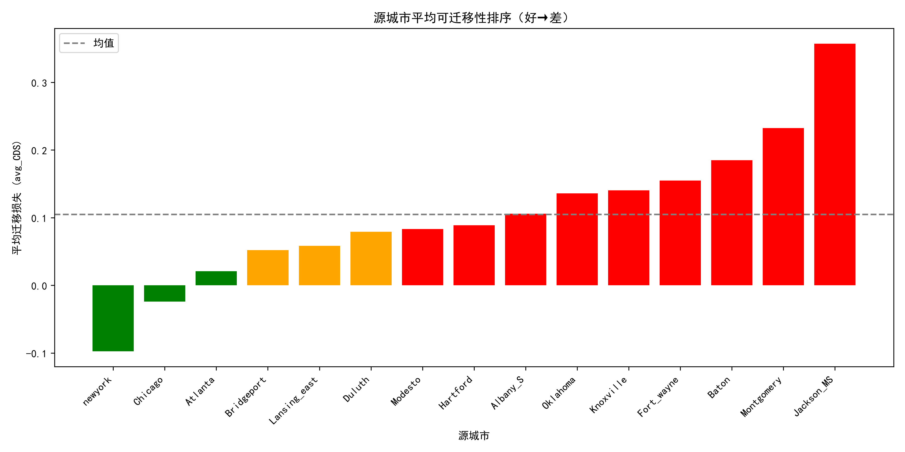
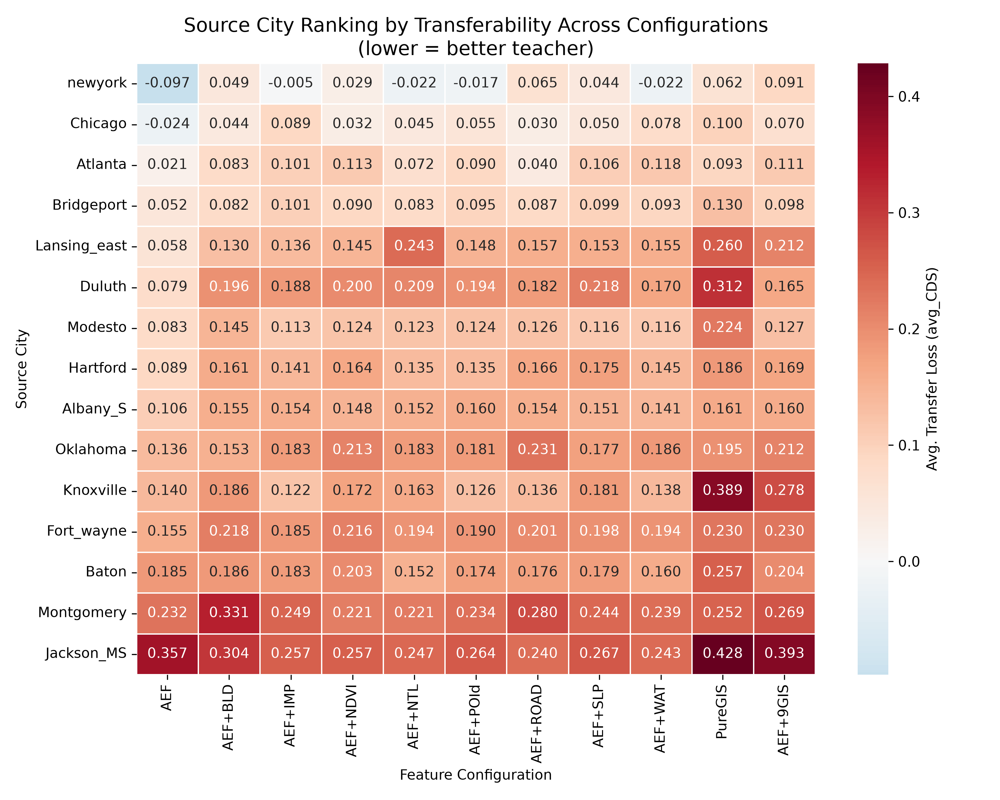
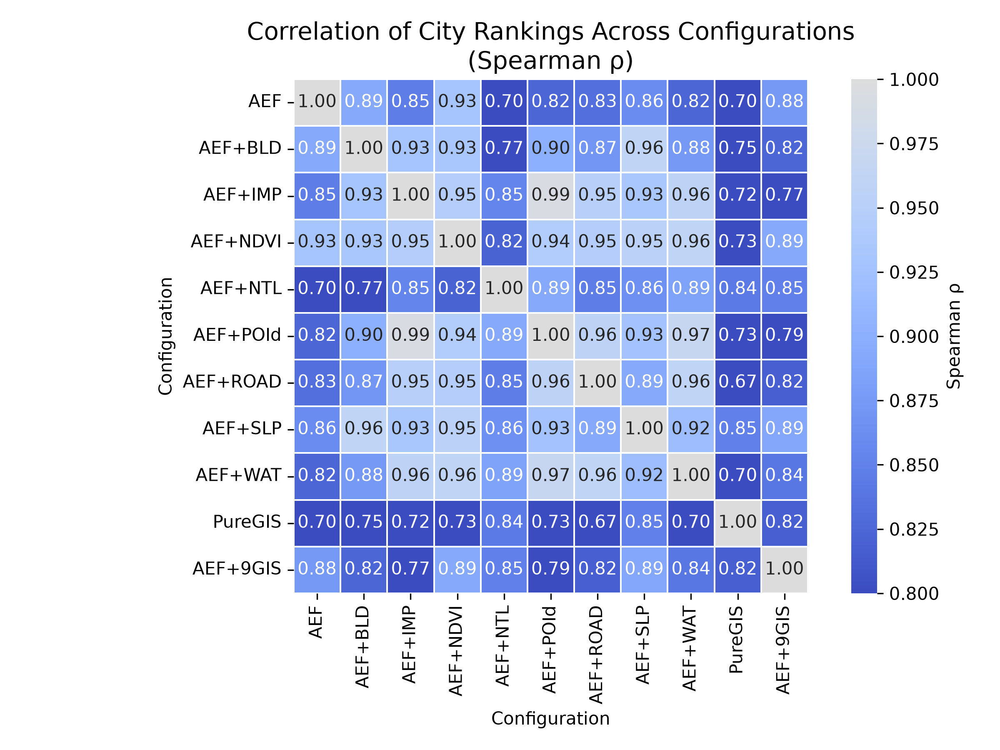
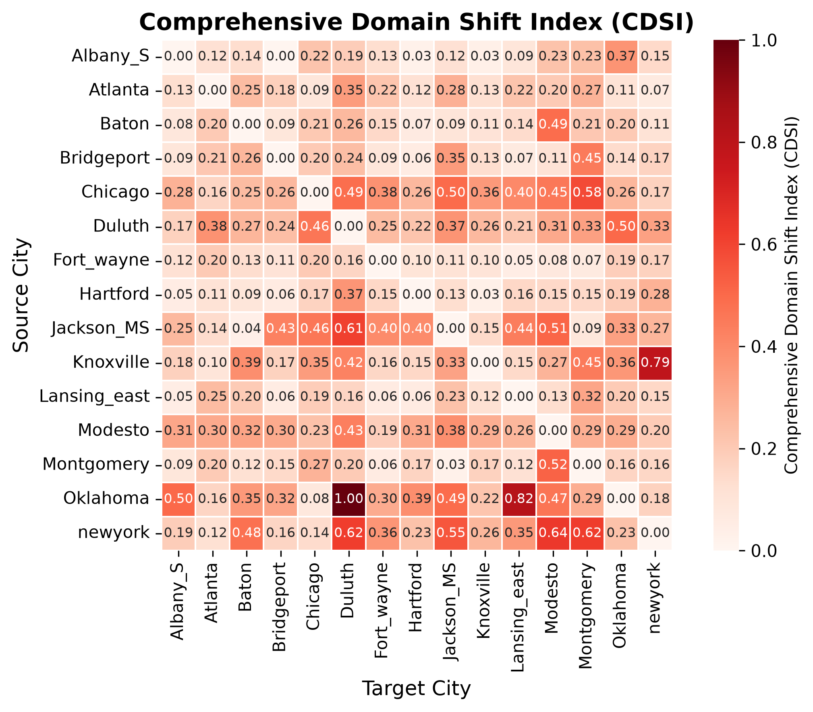
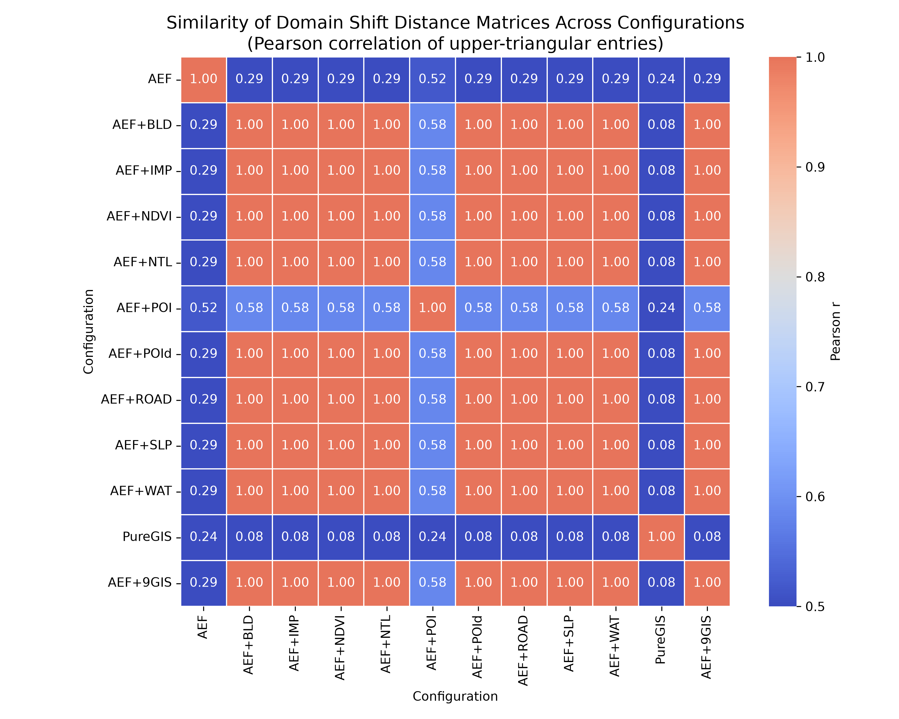
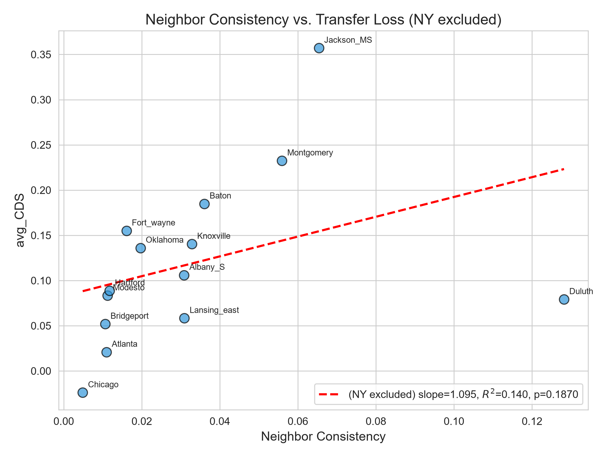
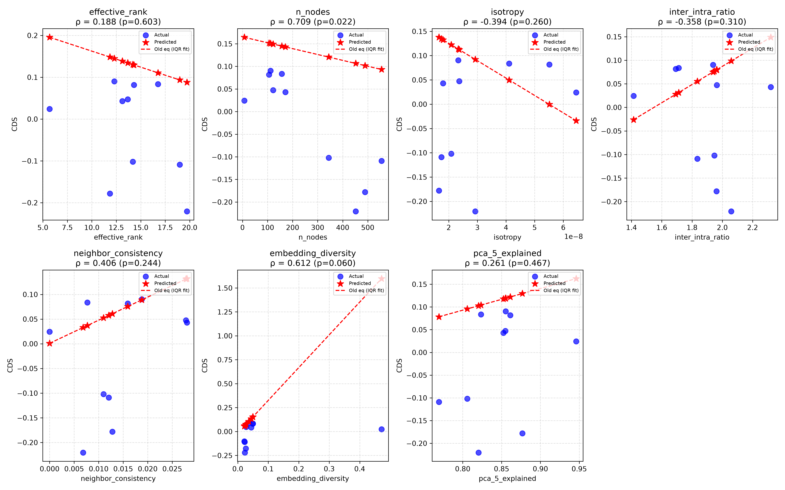
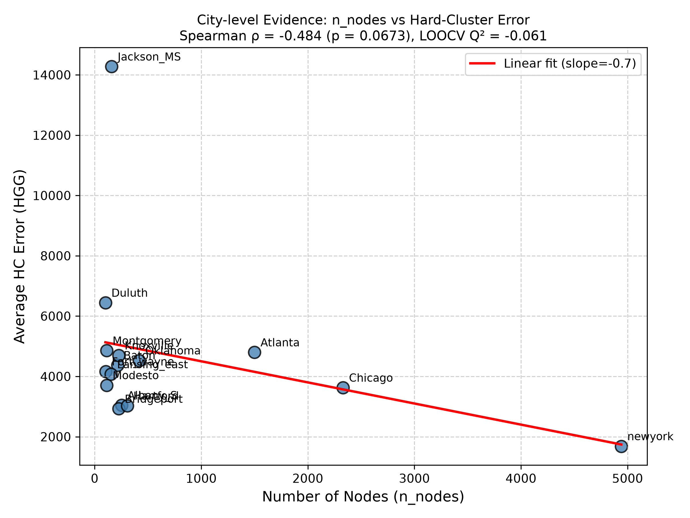

# AEF Population Prediction

本项目围绕 **AlphaEarth Foundations (AEF) 地理空间基础模型表征在 tract 级人口预测中的跨城市空间可迁移能力** 展开。项目并不只评价某一个城市内的拟合精度，而是把重点放在三个连续问题上：

1. AEF embedding 是否包含与人口密度相关的空间语义信息？
2. 在一个 MSA 训练得到的模型，能否迁移到未见过的 MSA？
3. 迁移成功或失败能否被 domain shift、源域结构特征和 tract 级误差机制解释？

最终版结题汇报位于：

- `结题.pptx`：根目录副本，作为项目说明入口。
- `docs/report_materials/结题.pptx`：报告材料归档副本。
- `docs/final_report_summary.md`：与最终 PPT 同步的文字版研究总结。

## Research Design

| 模块 | 设计 |
| --- | --- |
| 下游任务 | 2020 年美国 MSA 内 census tract 级人口密度预测 |
| 核心表征 | AlphaEarth Foundations Satellite Embedding，64 维，10 m，2020 年度 |
| 人口标签 | ACS B01003 总人口，按 tract 面积换算人口密度，并使用 `log1p` 缓解长尾 |
| 建模单元 | 15 个美国 MSA，11,179 个 census tract，覆盖约 43.6M 人口 |
| 图结构 | Queen contiguity，tract 共享边界或顶点即连边 |
| 主模型 | 2-layer GraphSAGE，mean aggregation，hidden size 64，dropout 0.5 |
| 训练划分 | city 内 train/val/test = 70/15/15 |
| 迁移评估 | source MSA 训练，target MSA 直接测试，构建 15 x 15 迁移矩阵 |
| 外部验证 | 新增 15 个 MSA 数据，用于验证源域结构指标的跨域排序能力 |

## Data System

本项目把数据明确分为三类：原始/整理后输入数据、模型可直接读取的数据、实验输出结果。

| 路径 | 作用 |
| --- | --- |
| `data_sources/raw_gis_features/` | 下载的传统 GIS 特征库，包括建成环境、自然环境、社会经济与人口结构相关材料。 |
| `data_sources/processed_aef/` | 整理好的 AEF 输入数据，按 MSA 保存 shapefile 组件与 AEF CSV。 |
| `data_sources/processed_gis/` | 整理好的 GIS 输入数据，按 MSA 保存 shapefile 组件与 GIS CSV。 |
| `data_sources/newyork_timeline/` | 纽约时间维度数据，当前作为后续时空扩展材料保留。 |
| `data_sources/validation_new_msa/` | 外部验证使用的新 15 个 MSA 数据。 |
| `data_sources/msa_reference/` | MSA 边界、tract 边界、ACS 人口标签与样本选择参考数据。 |
| `model_data/aef_root/` | 模型实际读取的派生 shapefile/CSV 输入树，包括 AEF、GIS 和 AEF+GIS 配置。 |

### GIS Feature Set

GIS 特征不是简单堆叠，而是按“多维正交、少冗余、防目标泄漏、与 AEF 互补”的原则筛选。核心实验使用 9 个变量覆盖 8 类城市维度。

| 城市维度 | 核心变量 | 含义 |
| --- | --- | --- |
| 建成强度 | `impervious_mean` | NLCD 不透水面比例，刻画城市化开发强度。 |
| 居住/就业容量 | `building_density` | OSM 建筑轮廓密度，刻画建成空间承载能力。 |
| 功能强度 | `poi_total_all` | OSM 综合 POI 密度，刻画功能活跃度。 |
| 功能构成 | `poi_diversity` | 7 类 POI 的 Shannon 混合熵，刻画城市功能类型差异。 |
| 活动强度 | `ntl_sum` | VIIRS 夜间灯光总光量。 |
| 网络连通 | `road_density_local` | TIGER/Line 地方道路密度。 |
| 植被本底 | `ndvi_mean` | Landsat 年度 NDVI 均值。 |
| 地形与区位 | `slope_mean`, `dist_water_m` | USGS 坡度和 JRC 水体距离，刻画开发约束与滨水区位。 |

社会经济和人口结构变量与 ACS/Census 标签来源高度相关，容易造成目标泄漏，因此没有纳入核心 GIS 特征组。

## Methodology

### 1. In-City Prediction

每个 MSA 内使用 AEF/GIS/AEF+GIS 特征训练人口密度模型，检验 AEF embedding 是否包含人口相关空间表征。典型参数如下：

| 参数 | 取值 |
| --- | --- |
| GNN architecture | 2-layer GraphSAGE |
| Aggregation | Mean aggregation |
| Hidden dimension | 64 |
| Dropout | 0.5 |
| Batch size | 64 |
| Optimizer | Adam |
| Learning rate | 0.001 |
| Epochs | 500 |
| Target transform | `log1p(population_density)` |

### 2. Cross-City Transferability

跨城市迁移以 source-target 城市对为单位：

1. 在 source MSA 上训练模型。
2. 将训练好的模型直接应用到 target MSA。
3. 记录 RMSE、MAE、R2、MAPE、Pearson r。
4. 使用熵权法合成综合性能分数。
5. 用 `CDS = Score_source - Score_cross` 表示跨域稳定性损失。

`avg_CDS` 是同一 source 对其它 target 的平均迁移损失；值越低，说明该 source 越适合作为“good teacher”。

AEF 配置下熵权法权重如下：

| 指标 | 权重 |
| --- | ---: |
| `rmse_raw` | 0.233 |
| `mae_raw` | 0.192 |
| `r2_raw` | 0.048 |
| `mape_raw` | 0.066 |
| `r_raw` | 0.462 |

### 3. Domain Shift Attribution

domain shift 用于解释城市间迁移性能差异。项目计算多类距离：

| 类型 | 指标 |
| --- | --- |
| 一阶矩距离 | L1 distance, L2 distance |
| 二阶矩距离 | CORAL |
| 分布距离 | MMD, KL divergence |
| 图拓扑距离 | Spectral distance, Degree difference |
| 综合指数 | CDSI，使用熵权法融合多维距离 |

AEF+GIS 配置中进一步拆解 `AEF_L2`、`GIS_L2`、`Weighted_L2` 和 `Label_Shift`，用 OLS、单变量回归、AIC 向前选择和分层进入策略评估边际解释力。

### 4. Source-Domain Health Metrics

为了低成本预判一个源城市是否适合迁移，本项目计算源域结构指标：

| 指标 | 含义 |
| --- | --- |
| `n_nodes` | 源城市 tract 节点数，近似反映城市样本规模。 |
| `neighbor_consistency` | 邻接 tract 标签平滑性。 |
| `effective_rank` | embedding 表征有效秩。 |
| `isotropy` | embedding 空间各向同性。 |
| `inter_intra_ratio` | 类间/类内差异比例。 |
| `pca_5_explained` | 前 5 主成分累计解释率。 |
| `embedding_diversity` | embedding 多样性指标。 |

## Key Results

### AEF Can Predict Population, But Transfer Is Uneven

城市内 self-training 结果表明，AEF embedding 确实包含人口相关空间信息。例如在 AEF 配置下，Albany_S、Baton、Bridgeport 的 self-test R2 分别约为 0.800、0.747、0.712。然而同一模型跨城市迁移时表现明显不均衡，说明“能拟合本地”不等于“能跨域泛化”。

### Good Teachers And Poor Teachers

AEF 配置下 `avg_CDS` 最低的源城市主要是 New York、Chicago、Atlanta、Bridgeport；迁移损失较高的源城市包括 Jackson_MS、Montgomery、Baton、Fort_wayne 等。

| 配置 | 较优源城市，avg_CDS 越低越好 | 较差源城市 |
| --- | --- | --- |
| AEF | New York (-0.097), Chicago (-0.024), Atlanta (0.021), Bridgeport (0.052) | Jackson_MS (0.357), Montgomery (0.233), Baton (0.185) |
| GIS | New York (0.062), Atlanta (0.093), Chicago (0.100), Bridgeport (0.130) | Jackson_MS (0.428), Knoxville (0.389), Duluth (0.312) |
| AEF + 9 GIS | Chicago (0.071), New York (0.091), Bridgeport (0.098), Atlanta (0.111) | Jackson_MS (0.393), Knoxville (0.278), Montgomery (0.269) |
| AEF + NDVI | New York (0.029), Chicago (0.032), Bridgeport (0.090), Atlanta (0.114) | Jackson_MS (0.257), Montgomery (0.221), Fort_wayne (0.216) |
| AEF + slope | New York (0.044), Chicago (0.050), Bridgeport (0.099), Atlanta (0.106) | Jackson_MS (0.267), Montgomery (0.244), Duluth (0.218) |

### GIS Features Are Useful Selectively, Not By Blind Stacking

实验显示，传统 GIS 特征能提供解释维度，但全量堆叠 9 个 GIS 特征并不一定改善迁移泛化。PPT 中总结的核心判断是：

- AEF 已经编码了一部分遥感可观测的地表形态信息，例如不透水面、NDVI、建筑密度等。
- NDVI、slope、POI diversity 等单一 GIS 特征在部分配置中能提高源城市排序一致性。
- 全量 AEF+9GIS 反而可能引入噪声维度，稀释 AEF 表征在 domain shift 度量中的主导信号。

### Domain Shift Is Statistically Relevant But Not Sufficient

domain shift 与迁移损失存在统计关系，但效应量有限。最终报告中的解释是：

- `Label_Shift` 是迁移损失的重要来源，人口规模/标签分布差异不可忽略。
- `AEF_L2` 在控制人口差异后仍有增量解释力。
- `GIS_L2` 的边际贡献较小，说明 GIS 特征并非自动提升可迁移性解释。
- MSA 级平均距离会压缩 tract 级局部失败机制，难以完整解释迁移成败。

### Source Health Metrics Can Support Low-Cost Source Selection

源域结构指标与 `avg_CDS` 的关系如下：

| 指标 | R2 | p-value | 解释 |
| --- | ---: | ---: | --- |
| `n_nodes` | 0.466 | 0.005 | 城市样本规模与迁移稳定性关系最稳健。 |
| `neighbor_consistency` | 0.271 | 0.047 | 邻域标签平滑性与迁移损失相关，但受异常城市影响。 |
| `embedding_diversity` | 0.220 | 0.078 | 有一定解释力，但显著性不足。 |
| `pca_5_explained` | 0.165 | 0.133 | 表征低维结构清晰度有弱相关。 |

在剔除 New York 和 Duluth 两个极端异常城市后，`neighbor_consistency` 与迁移损失的关系增强到 R2 = 0.774，p = 0.0001。外部新城市验证中，精确数值预测并不稳定，但排序预测有价值：`n_nodes` 在新 MSA 上取得 Spearman rho = 0.709，p = 0.022。

### Tract-Level Error Shows Concept Shift

迁移失败不是纯粹的 `P(X)` feature shift。高误差 tract 在空间上集聚，并集中于若干 AEF cluster，特别是紧凑高密度建成区。相同 AEF 形态在不同城市对应不同人口密度，说明关键困难更接近 `P(Y|X)` 的 conditional/concept shift。

## Figures

以下图件来自项目输出，可作为阅读项目结论的入口。

| Figure | What It Shows |
| --- | --- |
|  | AEF 配置下各 source MSA 的平均迁移损失排序。 |
|  | 不同 AEF/GIS 配置下 source city 排名与 avg_CDS 对比。 |
|  | 不同特征配置下 source 排序的一致性。 |
|  | AEF 表征空间中的城市间综合 domain shift。 |
|  | 不同特征配置的 L2 domain-shift 矩阵相似性。 |
|  | 源域邻居一致性与迁移损失关系。 |
|  | 源域健康指标外推到新 MSA 的验证结果。 |
|  | 城市规模指标与外部迁移表现的证据图。 |

## Repository Layout

| Path | Purpose |
| --- | --- |
| `data_sources/` | 源数据与整理后输入数据，包括 AEF、GIS、MSA reference、新 MSA 验证数据和纽约时间维度数据。 |
| `model_data/` | 模型可直接读取的派生数据和预训练模型权重。 |
| `scripts/modeling/` | 主训练、回归、迁移实验脚本。 |
| `scripts/analysis/` | domain shift、embedding health、回归解释和后处理分析脚本。 |
| `scripts/figures/` | 论文/报告图件生成脚本。 |
| `results/transfer_results/` | 原始迁移实验指标和矩阵。 |
| `results/transferability/` | 熵权法综合得分、CDS 矩阵和迁移能力结果。 |
| `results/domain_shift/` | AEF/GIS/domain-shift 距离矩阵与归因结果。 |
| `validation/` | 新 MSA 外部验证数据、脚本和结果。 |
| `paper_figures/` | 汇报/论文图件。 |
| `docs/` | 项目文档、最终报告文字版、报告材料索引和整理记录。 |
| `archive/` | 历史快照和非主流程材料。 |

## Main Scripts

从项目根目录运行脚本。主要入口包括：

```powershell
python scripts/modeling/GNN_regression.py --help
python scripts/modeling/GNN_transfer_experiments_calibrated.py --help
python scripts/modeling/GNN_transfer_GIS.py --help
python scripts/modeling/MLP_regression.py --help
python scripts/modeling/MLP_transfer.py --help
```

常用分析脚本：

| Script | Role |
| --- | --- |
| `scripts/analysis/transfer_domain/domain_shifting.py` | 基于嵌入和图结构计算 domain-shift 矩阵。 |
| `scripts/analysis/transfer_domain/domain_shift_with_gis.py` | 拆分 AEF/GIS/label shift 并计算加权距离。 |
| `scripts/analysis/embedding_health/embedding_health_analysis.py` | 分析源域嵌入健康度指标与迁移能力关系。 |
| `scripts/figures/paper_figure4_and_cross_config/cross_config_analysis.py` | 跨配置 source ranking 和 transferability 对比图。 |

## Path Policy

所有本地项目路径都以仓库根目录为基准写成相对路径，例如：

| Purpose | Relative Path |
| --- | --- |
| ACS population CSV | `data_sources/msa_reference/raw_msa_data/ACSDT5Y2020.pop/ACSDT5Y2020.B01003-Data.csv` |
| Main AEF inputs | `model_data/aef_root/clean_aef_shapefiles/` |
| Main GIS inputs | `model_data/aef_root/clean_gis_shapefiles/` |
| Pretrained GNN models | `model_data/pretrained_models/GNN/` |
| Transferability outputs | `results/transferability/` |
| External validation outputs | `validation/results/` |

Google Earth Engine 标识符如 `projects/.../assets/...` 是远程 asset 名，不是本地路径，因此保留在 `.js` 导出脚本中。

## Limitations And Future Work

当前结论支持 AEF 在人口预测中的表征价值，但也显示跨城市迁移存在明显 domain adaptation 问题。后续可沿三个方向继续推进：

1. 从空间迁移扩展到时空迁移：结合多时相 AEF 与人口数据，评价不同年份和城市发展阶段的动态迁移能力。
2. 从现象解释走向机制建模：引入 domain adaptation、因果推断或层次模型，刻画城市间 AEF-population 响应关系差异。
3. 从迁移评价走向应用策略：构建结合表征相似性、人口差异和 concept-shift 风险的源域选择与目标域适配框架。
